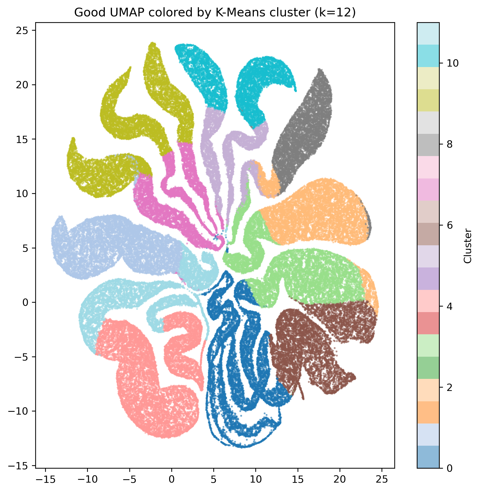
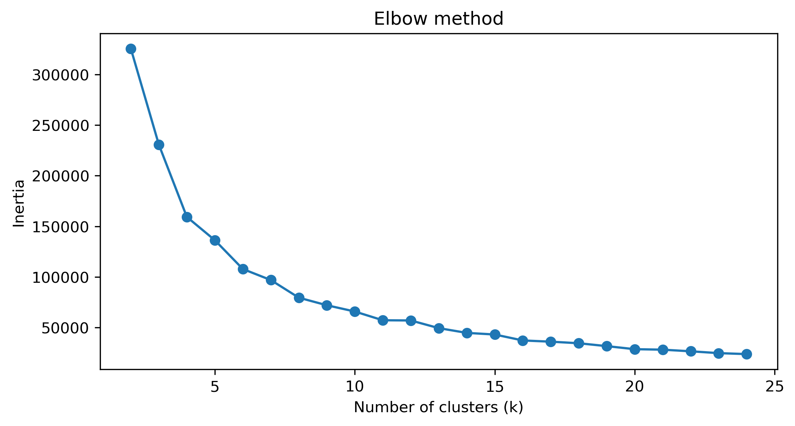

# MALDI-IMS Unsupervised Learning Workflow

A scalable imaging mass spectrometry (MSI) analysis pipeline using Zarr storage, Truncated SVD, K-Means clustering, and UMAP visualization for high-dimensional spectral data.

## Project Overview

Mass spectrometry imaging (MSI) datasets are extremely high-dimensional and can exceed system memory limits when processed naively.

This project implements an out-of-core analysis workflow that:
- Converts MSI spectra into efficient Zarr-backed arrays
- Applies Truncated SVD for dimensionality reduction
- Uses K-Means clustering for tissue segmentation
- Visualizes latent structure using UMAP

The pipeline was designed for scalable analysis of large MSI datasets while minimizing memory overhead.

## Methods

### Zarr-Based Storage
Large spectral matrices were stored using Zarr to enable chunked, out-of-core computation and to avoid loading the full dataset into memory.

### Dimensionality Reduction
Truncated SVD was used as a scalable approximation to PCA for sparse, high-dimensional MSI data.
 
 

### Clustering
K-Means clustering was applied in latent space to identify spatially coherent tissue regions.
Only needed the first five components.
 

### Visualization
UMAP embeddings were generated to visualize nonlinear relationships between spectra in low-dimensional space.
 

## Advanced Topics Implemented

This project incorporates the following advanced topics:

- **Zarr Database Creation**
  - Implemented chunked out-of-core storage for large MSI datasets

- **Truncated SVD / PCA**
  - Applied scalable dimensionality reduction to sparse spectral matrices

- **K-Means Clustering**
  - Performed unsupervised segmentation in latent feature space.

- **UMAP**
  - Generated nonlinear low-dimensional embeddings for visualization and exploratory analysis

 
